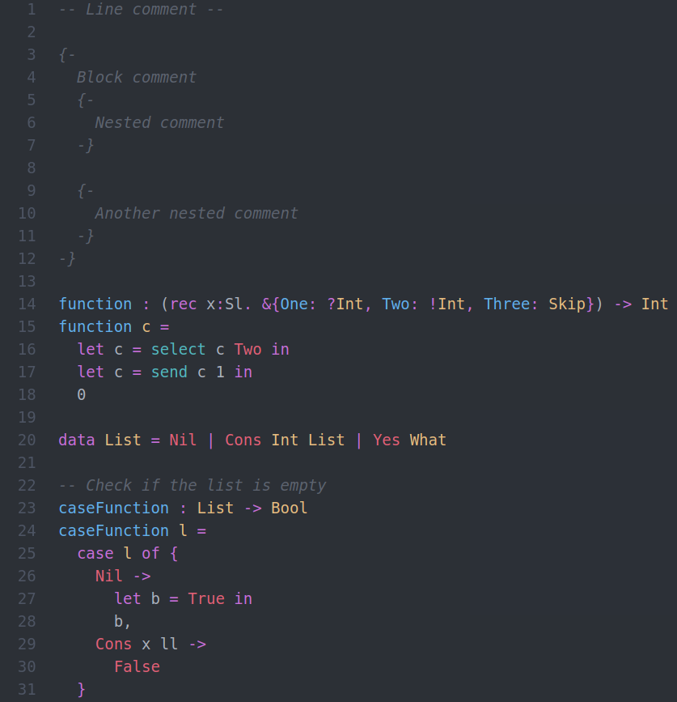

# Atom syntax highlighter for FreeST

## Features
* Line and block comments (nested included);
* Function type declaration and body;
* Session types;
* Basic data types;
* Data declarations;
* Case, match and let expressions;
* Polimorfic function calls;
* FreeST functions such as select, send, ..., are highlighted differently.

This syntax highlighter also helps with the language's syntax by highlighting only when it is well formed.

### Future features
 - [ ] Better recursive channel highlighting
 - [ ] Better forall expression highlighting

## Adding the Atom package
1. Download this package
1. Move it to **~/.atom/packages/**
1. You're done!

## Author(s)
Diogo F. P. Barros, LASIGE, July 2020
